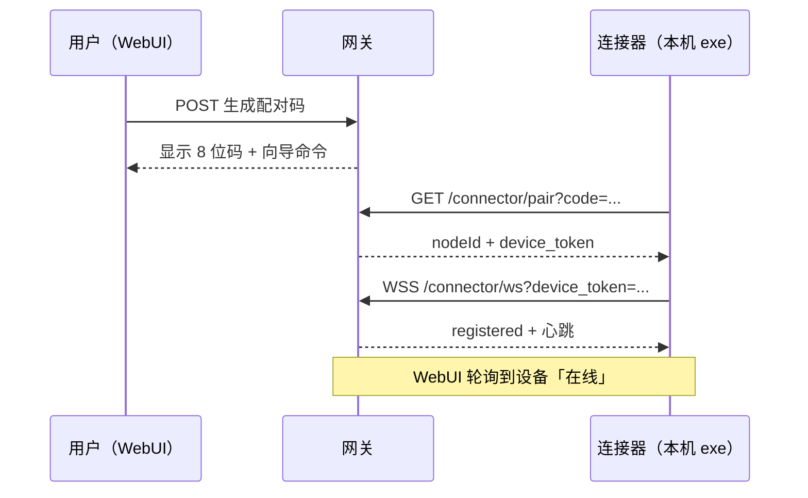

# nanobot Connector 设计说明（实现原理）

> **文档编号**: NBC-OVERVIEW-001  
> **版本**: v1.0  
> **状态**: 现行  
> **配套文档**: [01-项目计划](./01-项目计划.md)、[02-技术设计](./02-技术设计.md)（v1 只读基线）、[03-用户手册](./03-用户手册.md)、[04-运维手册](./04-运维手册.md)、[05-增强能力设计](./05-增强能力设计.md)（v2 受控执行 / v2.5 本地 MCP 代理 / v3 桌面控制）

---

## 1. 一句话总结

**用一次性配对码把「你的电脑」注册成网关信任的设备；之后你的电脑主动连上网关，Agent 通过这条长连接按需读取你共享的文件夹——无需上传整包资料，也无需在你电脑上开端口。**

---

## 2. 为什么要 Connector？

| 部署方式 | Agent 能看到的文件 |
|----------|-------------------|
| nanobot 跑在服务器 | 仅服务器磁盘 |
| 资料在员工本地电脑 | 服务器 Agent **默认访问不到** |

典型场景：网关在公司内网服务器，PPT 素材在员工笔记本 `D:\PPT资料`。Connector 让 Agent **按需拉取**白名单目录中的文件到服务器工作区，再调用现有工具生成 PPT。

---

## 3. 核心模式：反向连接

与传统「服务器 SSH 进你电脑」相反，Connector 采用与 **CMDB 采集器 / 内网 Agent** 相同的模式：

```
┌──────────────────── 网关（服务器）────────────────────┐
│  WebUI ──► 配对码管理                                  │
│  Agent ──► connector_* 工具 ──► ConnectorHub          │
│                    ▲                                   │
│                    │ 出站 WSS（客户端主动连上来）        │
└────────────────────┼───────────────────────────────────┘
                     │
┌────────────────────┼────────────────── 你的电脑 ────────┐
│  nanobot-connector.exe                                 │
│    · 配对（HTTP 一次性）                                │
│    · 长连接（WSS + device_token）                       │
│    · 只读服务白名单目录                                 │
└────────────────────────────────────────────────────────┘
```

**要点：**

- 资料电脑只做 **出站连接**，不需要公网 IP，**不需要开端口**。
- NAT、公司防火墙通常只拦入站，不拦出站，因此穿透简单。

---

## 4. 配对原理（两段式认证）

配对分两步，对应「人在 WebUI 操作」与「机器领长期凭证」：

### 4.1 第一步：WebUI 生成配对码

1. 已登录用户在 WebUI **设置 → 设备 → 添加设备**。
2. 网关 `DeviceStore` 生成 **8 位、一次性、约 10 分钟有效** 的配对码。
3. 配对码与当前 WebUI 用户（`owner_id`）绑定，写入 `workspace/connector/devices.json`。

**意义：** 只有能登录 WebUI 的人，才能给新设备「发门票」。

### 4.2 第二步：连接器兑换设备令牌

连接器（GUI exe 或 CLI）向网关发起 HTTP 请求：

```http
GET /connector/pair?code=<配对码>&name=<设备名>&platform=windows&fingerprint=<机器指纹>
```

（`ws://host:8765` 在配对阶段会转为 `http://host:8765/connector/pair`。）

网关校验通过后返回（**仅此一次**）：

```json
{ "nodeId": "dev-xxxxxxxx", "token": "<device_token>" }
```

| 存储位置 | 内容 |
|----------|------|
| 客户端 `~/.nanobot-connector/config.json` | 明文 `device_token`、server、共享目录等 |
| 服务端 `devices.json` | 仅 `sha256(token)`，不存明文 |

配对码随即作废，不可重复使用。同一机器指纹重复配对会替换旧设备记录并吊销旧令牌。

### 4.3 配对时序



---

## 5. 长连接与文件访问

### 5.1 注册与心跳

配对成功后，连接器建立 WebSocket：

```
wss://<网关>:8765/connector/ws?device_token=<token>
```

首帧 `register` 上报：设备名、平台、机器指纹、**共享目录列表（roots）**。之后周期性 `heartbeat`，网关维护在线表。

### 5.2 Agent 如何读到你的文件？

用户在对话中说：「用我电脑上某文件夹里的资料做 PPT」。Agent 调用服务端工具，例如：

| 工具 | 作用 |
|------|------|
| `connector_list_nodes` | 列出已配对、在线的设备 |
| `connector_list_files` | 列远程共享目录下的文件 |
| `connector_search_files` | 在共享目录内搜索 |
| `connector_read_file` | 小文件内联读取 |
| `connector_fetch_file` | 大文件分块拉取到服务器工作区 |

调用链：

```
Agent 工具 → ConnectorHub.rpc() → WSS 发到对应 node_id
         → 连接器 files.py 校验路径在白名单内
         → 只读返回 / 分块上传
         → 网关落盘到 workspace/connector/<nodeId>/
         → Agent 用工作区路径继续处理（如生成 PPT）
```

**文件不是事先整包上传**，而是 **按需、按文件拉取**。

### 5.3 客户端白名单

连接器只暴露用户显式共享的目录（GUI 里选的文件夹，或 CLI `allow` 添加的路径）：

- 拒绝 `..`、符号链接逃逸、盘符根目录（如 `C:\`）。
- v1 **只读**：`list` / `search` / `read` / `fetch`，无写入、无远程执行命令。

每次 `fs.*` 调用在客户端写审计日志：`~/.nanobot-connector/logs/audit.log`。

> **v2/v2.5/v3 更新（能力分层）**：在 v1 只读基线之上，连接器提供三档**可选、默认关闭**的增强，均建立在同一套授权/审批/审计地基上，命令不由服务端构造、设备主人主权不变：
> - **v2 受控执行**（`allowExec`）：调用设备主人在本机显式登记的工具（参数模板校验、无 shell）。
> - **v2.5 本地 MCP 代理**（`allowMcpProxy`）：桥接设备本机运行的 MCP server，其工具经连接器通道供 Agent 调用。
> - **v3 桌面控制**（`allowDesktopControl`）：截屏 + 键鼠注入的 computer-use，强制人在环、无 `auto`、帧默认不落盘。
>
> 完整架构、协议、安全模型、配置与路由见 [05-增强能力设计](./05-增强能力设计.md)。

---

## 6. 端口与地址（常见误区）

nanobot 配置里有两个端口概念：

| 配置项 | 典型值 | 用途 |
|--------|--------|------|
| `gateway.port` | 18790 | 设置页「网关」展示、部分元数据 |
| `channels.websocket.port` | **8765** | **WebUI、API、Connector 实际监听端口** |

连接器配对与长连接必须使用 **WebSocket 端口（8765）**，例如：

```text
ws://192.168.1.100:8765
```

填成 `18790` 会出现 **HTTP 404**（该端口未挂载 `/connector/pair`）。

跨电脑访问时，还需将 `channels.websocket.host` 设为 `0.0.0.0` 并重启 gateway，资料电脑填网关的 **内网 IP**，而非 `127.0.0.1`。

---

## 7. 安全设计摘要

| 机制 | 作用 |
|------|------|
| 配对码一次性 + TTL | 降低码被窃取后的滥用窗口 |
| 设备 token 服务端只存哈希 | 配置泄露难以还原可用令牌 |
| 出站连接 | 资料机无需暴露入站端口 |
| 目录白名单 + 只读 | 最小权限，不能扫全盘、不能写 |
| 配对失败限速 / 熔断 | 防暴力猜码 |
| WebUI 吊销 | 吊销后断开连接，旧 token 失效 |
| TLS + 可选证书指纹固定 | 支持自签证书的内网部署 |

---

## 8. 组件与代码位置（实现对照）

| 层级 | 路径 | 职责 |
|------|------|------|
| 服务端协议 | `nanobot/connector/protocol.py` | 帧格式、版本 |
| 设备与配对 | `nanobot/connector/devices.py` | 配对码、令牌、吊销 |
| 连接枢纽 | `nanobot/connector/hub.py` | 在线表、RPC、转发 |
| 文件落盘 | `nanobot/connector/transfer.py` | 分块组装、sanitize、LRU 缓存 |
| 网关路由 | `nanobot/connector/gateway.py` | `/connector/pair`、`/connector/ws`、`/api/connector/*` |
| Agent 工具 | `nanobot/agent/tools/connector.py` | `connector_*` 五个工具 |
| 客户端 | `connector/nanobot_connector/` | CLI、GUI、WSS 客户端、白名单文件服务 |
| WebUI | `webui/.../ConnectorDevicesSettings.tsx` | 设备列表、配对向导、下载入口 |

---

## 9. 与用户操作的关系

你完成的「配对成功」在系统里意味着：

1. WebUI 生成的配对码已在服务端兑换为 `nodeId` + `device_token`。
2. exe 已用 token 建立 WSS 长连接，并在 `register` 中上报共享目录。
3. WebUI **设备**页显示该设备 **在线**。
4. 此后 Agent 可通过 `connector_*` 工具访问该设备白名单内的文件。

**保持连接器窗口打开** = 保持长连接；关闭窗口即断开，Agent 会报设备离线。

更详细的协议字段、配置项与运维步骤见 [02-技术设计](./02-技术设计.md) 与 [04-运维手册](./04-运维手册.md)。
